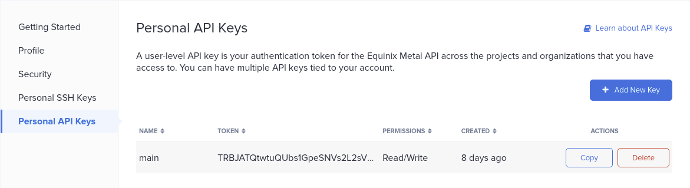

## [`metal`](../README.md)`/phase0`
Terraform module for the `metal.equinix` bare-metal server platform

---
### `run`
Once you have defined your `/phase0/terraform.tfvars` file - you can simply execute terraform  
```
terraform init
terraform plan
terraform apply
```

`auth_token` is mandatory, all remaining `inputs` are optional and have default values.  

---
### `inputs`
You will require an active account on [`https://console.equinix.com`](https://console.equinix.com)  
You can obtain an **API KEY** by performing the following steps in the console:  
- Login to [`https://console.equinix.com`](https://console.equinix.com)  
- Click your account name in top-right corner and select `Personal API Keys`  
- Click `+ Add New Key`  
- Enter `Description` and ensure permission set to `Read/Write`
- Click `Add`
- Copy the key to use as your `auth_token` in the  `/phase0/terraform.tfvars` file



Next, create a new file `/phase0/terraform.tfvars` and populate your variables as follows.    
In this example, `auth_token` is mandatory, all remaining values are optional and show defaults.  
```
auth_token        = "<api-token>"
project           = "labops"
metro             = "sy" ## sydney
plan              = "c3.small.x86"
operating_system  = "vmware_esxi_7_0"
hostname          = "core"
```

The above will deploy a single esx node into a *new* `project` called `labops` in the console  


---
#### `project`
`project` is the name of a project to deploy the `metal` resources into.  
This project will be newly created in the metal.equinix console.  
It defaults to the name `labops`  

---
#### `metro`
`metro` code refers to the geographical region for server deployment.  
It defaults to `sy` for the `sydney` region.  

Select the `metro` that best fits your lab requirements.  
Available `metro` code list is here:  
https://metal.equinix.com/developers/docs/locations/metros

---
#### `plan`
server `plan` defaults to `c3.small.x86` with the following specs:

| Item | Value |
| --------- | ---------------------- |
| `rate`    | $0.50 / hour           |
| `cpu`     | 1 x Intel Xeon E-2278G |
| `cores`   | 8 cores @ 3.40 GHz     |
| `boot`    | 2 x 480 GB SSD         |
| `memory`  | 32 GB RAM              |
| `network` | 2 x 10 Gbps            |

Select the server `plan` that best fits your lab requirements (such as nested ESX).  
Full server `plan` list is here:  
https://metal.equinix.com/developers/docs/servers/server-specs

---
#### `operating_system`
`operating_system` specifies the operating system to be installed on the metal host.  
It defaults to the `vmware_esxi_7_0` in this module for ESX.  

More information on support operating systems is here:  
https://metal.equinix.com/developers/docs/operating-systems/licensed  

To find additional values for `operating_system` variable, use the `/operating-systems` API here:  
https://metal.equinix.com/developers/api/operatingsystems  

Note that different `operating_systems` have minimum supported server `plan` values.  

---
#### `hostname`
`hostname` specifies the hostname of the `metal` device.  
It defaults to `core` for this module.  

---
### `destroy` [optional]
```
terraform destroy
```

---
